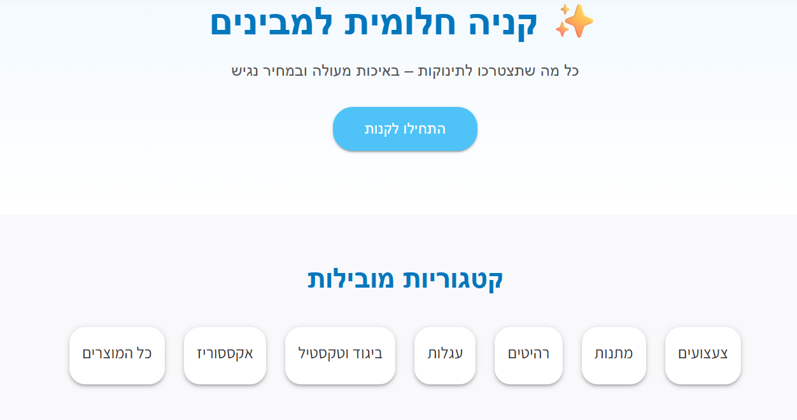
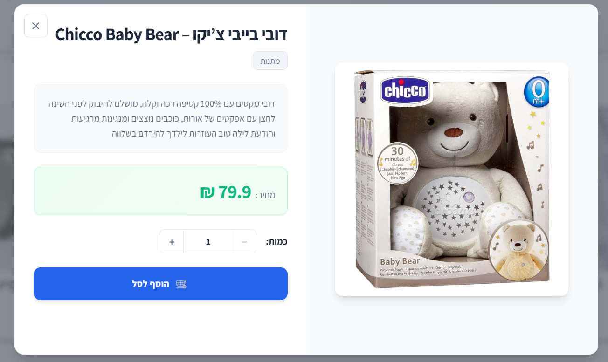
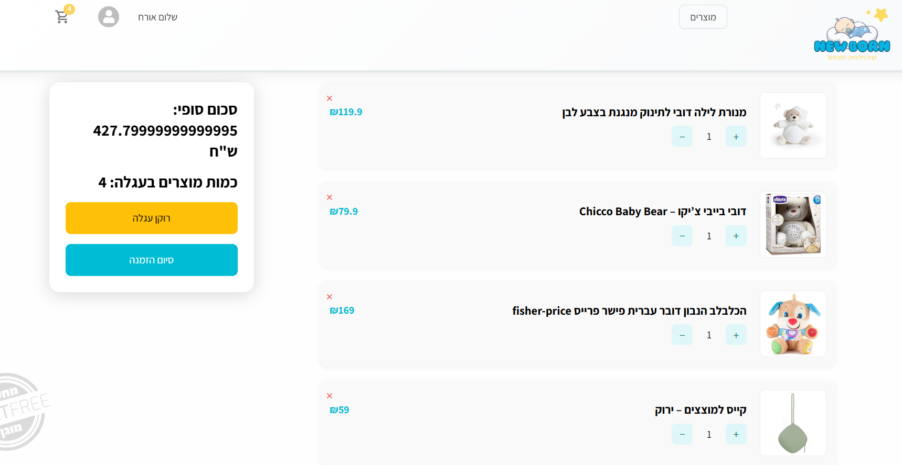
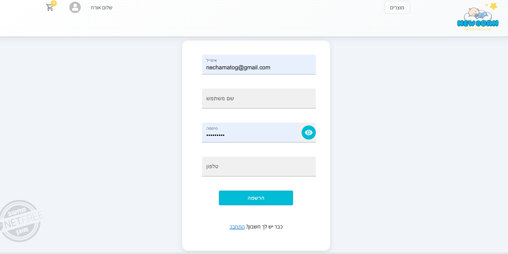
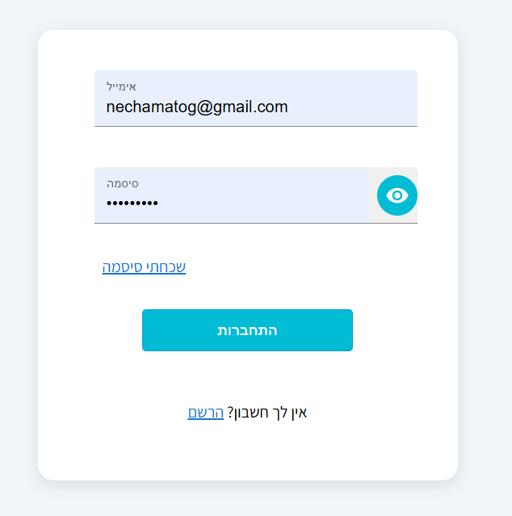
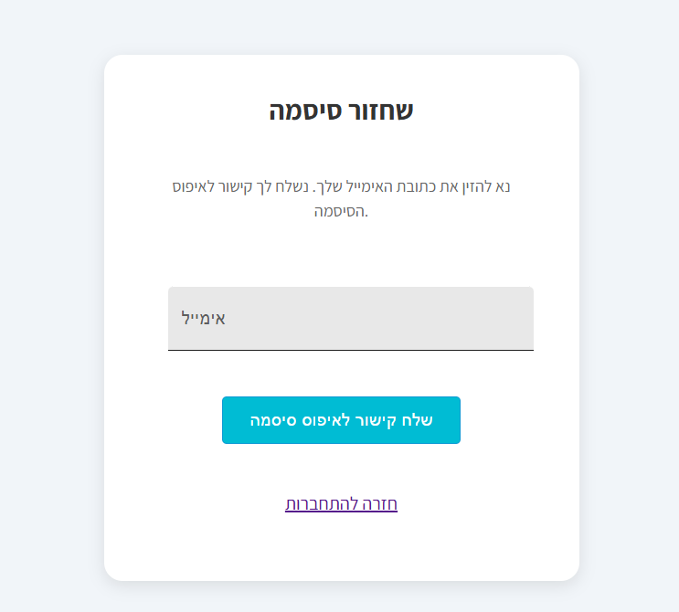
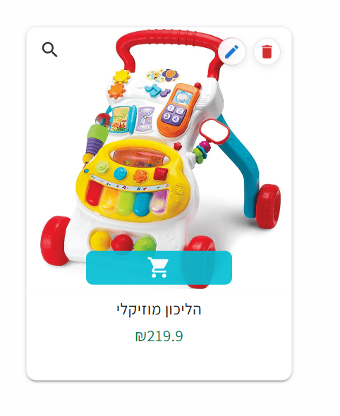
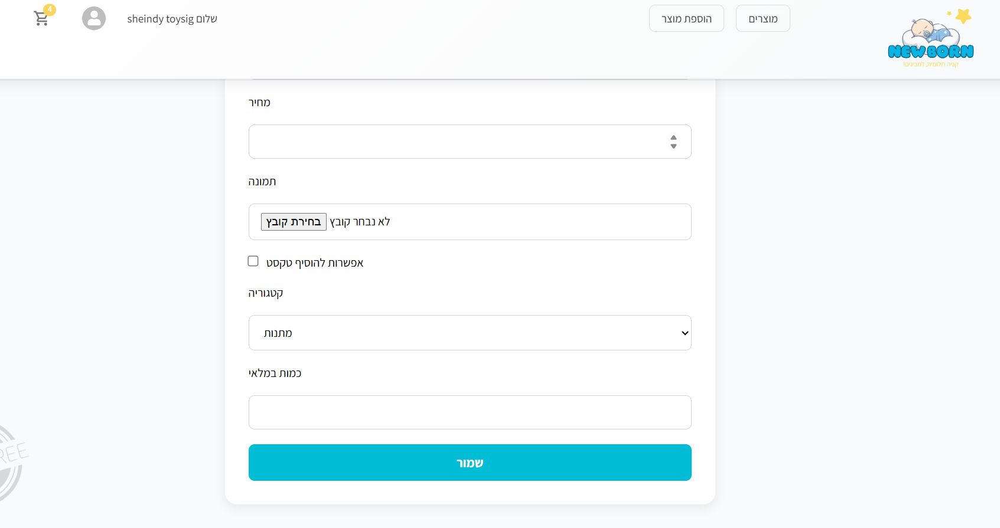
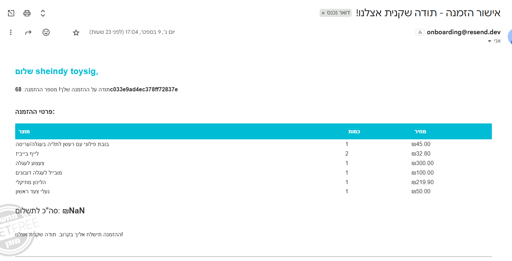

# 🍼 Baby Store - Virtual Shop

A web application for managing and browsing a virtual baby store.
This project demonstrates **frontend development with React** and **backend development with Node.js + MySQL**.

🌐 Live Demo: [View the Baby Store Online](https://new-born-byta.netlify.app/)

---

## 📸 Project Overview

* Browse products by categories
* View individual product details
* Add items to cart
* Place an order as a customer (currently, order confirmation email is sent only to a predefined email as no domain is set up yet)
* Inventory management: each product has stock count and system prevents orders exceeding stock
* Admin features:

  * View all products just like a regular customer
  * Each product has two extra buttons: Edit and Delete
  * Link to add a new product
  * Admin can perform all regular user actions plus management actions
* User authentication: registration, login, and password reset via email
* Responsive design with Material UI

### Screenshots

### User View
<div style="display: flex; gap: 10px; flex-wrap: wrap;">
  
  
  
  
  
  
</div>

### Admin View
<div style="display: flex; gap: 10px; flex-wrap: wrap;">
  
  
</div>

### Emails
<div style="display: flex; gap: 10px; flex-wrap: wrap;">
  
</div>


---

## 🛠️ Tech Stack

| Frontend                  | Backend                 | Deployment                        |
| ------------------------- | ----------------------- | --------------------------------- |
| React, Redux, Material UI | Node.js, Express, MySQL | Netlify (client), Heroku (server) |

---

## 📂 Project Structure

```
root/
├─ client/           # React frontend
├─ server/           # Node.js backend
├─ screenshots/      # All project screenshots
├─ README.md         # This file
```

---

## 🚀 Getting Started

Clone the project:

```bash
git clone https://github.com/sheyndi/newborn-store-app.git
cd baby-store
```

Install dependencies for client and server:

```bash
cd client
npm install
cd ../server
npm install
```

Run the app:

```bash
# Run frontend
cd client
npm start

# Run backend
cd ../server
npm run dev
```

> Make sure to set up your `.env` file in the server folder for DB connection.

---

## 💡 Code Highlights

* [dataFetchReducer](client/src/hooks/dataFetchReducer.js) – custom hook for API requests with status management
* Reusable form validation with React Hook Form (login and signup forms)
* Clear separation of concerns: structured components, services, and hooks

---

## 🔗 API Overview (short)

* `GET /product` – fetch all products
* `GET /product/:id` – fetch individual product details
* `POST /order` – create a new order
* `POST /user/login` – user login
* `POST /user/register` – user registration
* `POST /user/reset-password` – password reset request

*Full API documentation is available in the server folder.*

---

## 🔮 Future Improvements

* Product search and filters
* Payment integration
* Advanced inventory management (alerts, restocking, history)
* Sending order confirmation emails to the actual customer email once a domain/email service is set up
